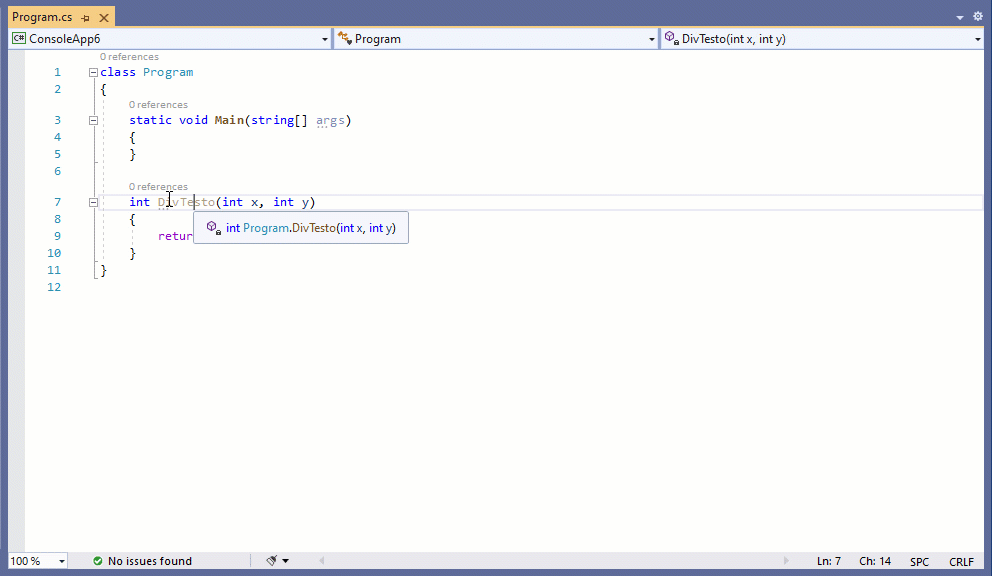

# Disasmo
VS2019 Add-in. 
Click on any method or class to see what .NET Core's JIT generates for them (ASM).

The Add-in targets .NET Core contributors so it assumes you already have CoreCLR local repo.
If you don't have it, the steps to obtain and configure it are:
```bash
git clone git@github.com:dotnet/coreclr.git
cd coreclr
build release skiptests
build debug skiptests
```
We have to build it twice because we need mostly release files and a debug version of `clrjit.dll`.
For more details visit [viewing-jit-dumps.md](https://github.com/dotnet/coreclr/blob/master/Documentation/building/viewing-jit-dumps.md).
The the Add-in basically follows steps mentioned in the doc:
```
dotnet restore
dotnet publish -r win-x64 -c Release
set COMPlus_JitDisasm=%method%
ConsoleApp123.exe
```
In order to be able to disasm any method (even unused) the add-in injects a small line to the app's `Main()`:
```csharp
System.Runtime.CompilerServices.RuntimeHelpers.PrepareMethod(%methodHandle%);
```

[VSMarketplace Link](https://marketplace.visualstudio.com/items?itemName=EgorBogatov.Disasmo)



## Known Issues
* Only .NET Core Console applications are supported.
* I only tested it for .NET Core 3.0 apps
* Multi-target projects are not supported
* Generic methods are not supported
* When TieredJit is enabled it only outputs tier0's asm (even with `[MethodImpl(MethodImplOptions.AggressiveOptimization)]`)

## 3rd party dependencies
* [MvvmLight](https://github.com/lbugnion/mvvmlight) (MIT)
* [AvalonEdit](https://github.com/icsharpcode/AvalonEdit) (MIT)
