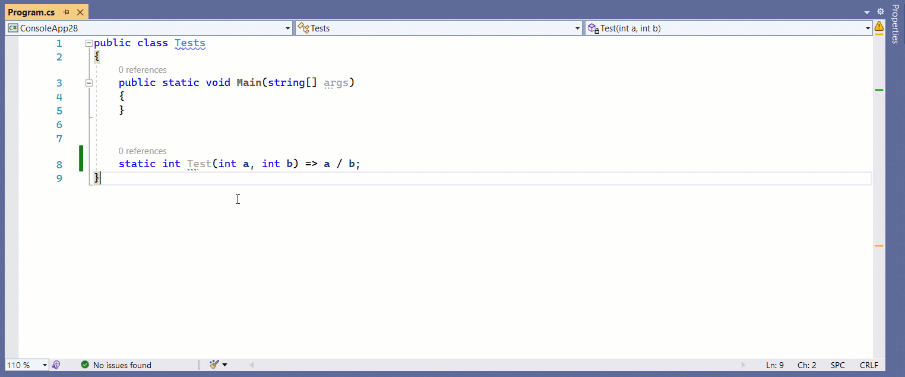

# Disasmo
[VS2019 Add-in.](https://marketplace.visualstudio.com/items?itemName=EgorBogatov.Disasmo)
Click on any method or class to see what .NET Core's JIT generates for them (ASM).




The Add-in targets .NET Core contributors so it assumes you already have a local dotnet/runtime repo.
If you don't have it, the steps to obtain and configure are:
```bash
git clone git@github.com:dotnet/runtime.git
build.cmd Clr -c Checked
```
## Installation
Click on `Extensions\Manage Extensions` menu, select `Online` tab and type `Disasmo` in the "Search" 
text box. Once the add-in is installed you have to close all active instances of VS2019
to let the installer finish its job.

## Known Issues
* Only .NET 5.0 and later projects are supported
* I only tested it for simple Console Apps
* Generic methods are not supported
* **Resharper** hides Roslyn actions by default (Uncheck "Do not show Visual Studio Light Bulb").
* The lightbulb can be slow on first launch
* AltJIT (e.g. ARM ones) don't emit hw intrinsics (see https://github.com/dotnet/runtime/issues/41518)

## 3rd party dependencies
* [MvvmLight](https://github.com/lbugnion/mvvmlight) (MIT)
* [AvalonEdit](https://github.com/icsharpcode/AvalonEdit) (MIT)
* [BenchmarkDotNet](https://github.com/dotnet/BenchmarkDotNet) (MIT)
* [ObjectLayoutInspector](https://github.com/SergeyTeplyakov/ObjectLayoutInspector) (MIT)
