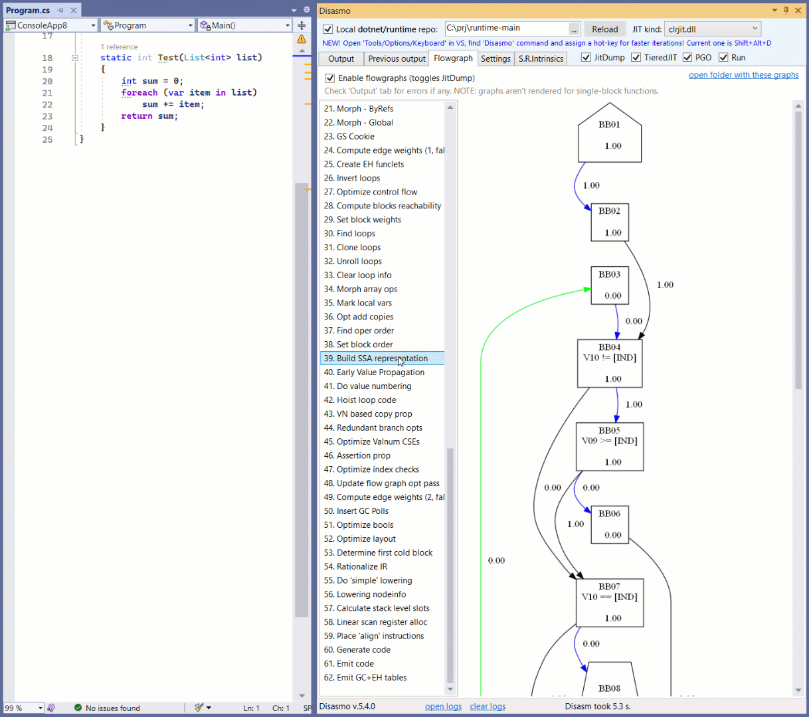

# 5.4.1

* Hot-fix for flowgraphs
* Fixed "Disable LightBulb" option

# 5.4.0

* Added support for "netX.Y-zzz" TFMs
* Added advanced flowgraph viewer:

# 5.2.1

* Fixed NativeAOT freeze
* Fixed local functions
* Added multiple TFMs support (`<TargetFrameworks>`)
* Added support for unloadable ALCs (non-run mode) - to see codegen of methods in a collectible context
* S.R.I view doesn't crash VS any more when HttpClient fails
* Relaxed net7.0 requirement for non-local dotnets
* Settings view is now scrollable
* Few tricks for faster disasm in non-run mode

# 5.1.8

* Workaround for mangled type names (e.g. source-generators)
* NativeAOT no longer use hard-coded paths to runtime repo
* Hot-key now tries to open Disasmo UI if it's not open 

# 5.1.7

* Fixes for NativeAOT (to use Checked rather than Release config)
* Fixes for "use dotnet publish"

# 5.1.6

* Fixes for breaking changes in JitDisasm format from dotnet/runtime
* NativeAOT is added (for locally built runtimes only for now)

# 5.1.5

* Custom runtime no longer needed if .NET 7.0 RC1 (or newer) is installed
* Added support for constructors
* Hot-key is added (Alt+Shift+D by default, configurable)
